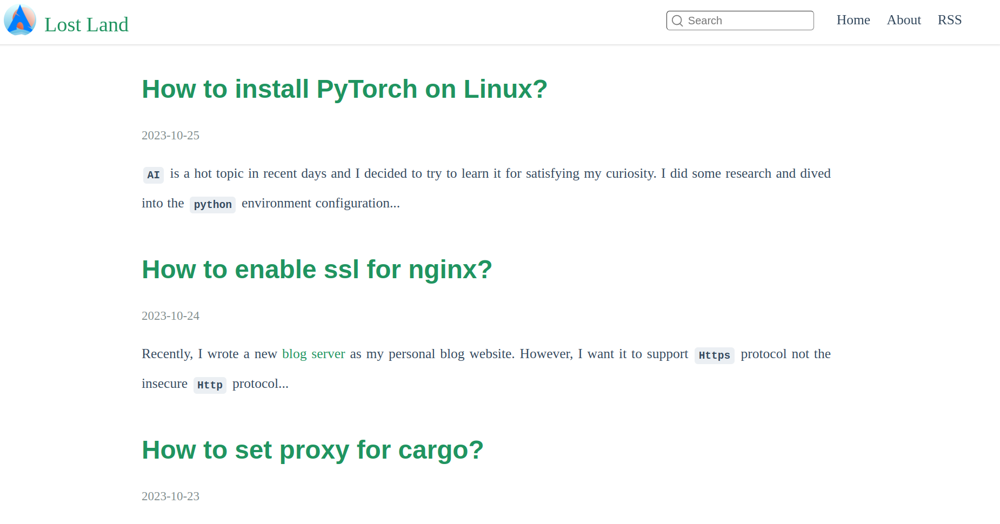

[中文文档](./README.zh-CN.md)

#### Introduction
This is a simple blog that provides web services using `Rust Rocket` and generates web pages through HTML templates.

#### How to deploy?
After the first startup, the default HTML template will be generated. The template is located in the `~/.local/share/sblog/template` directory and includes the following files:
````
template
├── about-body.html
├── about-body.md
├── frame.html
├── header.html
├── home-body.html
└── post-body.html
````
The `about-bodd.md` file is empty and needs to be filled with specific content according to your needs. The content format should be in Markdown.
You can also modify the HTML files according to your needs.

After the first startup, the default configuration file will be generated. The configuration file is located at `~/.config/sblog/sblog.conf`.
````
{
  "server": {
    "listen_address": "0.0.0.0",
    "listen_port": 8080
  },
  "rssinfo": {
    "author": "author",
    "email": "your-email",
    "uri": "https://example.com"
  },
  "webinfo": {
    "site_logo_tab": "/assest/logo.png",
    "site_logo": "/assest/logo.png",
    "site_name": "your-blog-name"
  }
}
````
`rssinfo` and `webinfo` are parameters for the HTML template and **must** be filled in.

#### How to publish articles?
- Articles should be placed in the `~/.local/share/sblog/post/md` directory. The article format should be in Markdown, and the article name format **must** be: `title@@tag@@publish-date`. For example: `markdown@@tag1,tag2@@2023-12-01.md`.
- The `homepage` and `rss` require a `summary` information, which is saved in the `~/.local/share/sblog/post/summary` directory. The file name **must** be the same as the article's `title`. The format of the `summary` is: `title.summary`. For example: `markdown.summary`.
- Blog resource files can be saved in the `~/.local/share/sblog/post/assest` directory. You can use `[example](/post/assest/a.txt)` to reference them in your articles.

#### How to build?
- Install `Rust` and `Cargo`
- Run `make`
- See [Makefile](./Makefile) for more information

#### How to test?
- Start the `sblog` service.
- Run `make install-testdata` to install test data.
- Open a browser and visit `localhost:8080` to access the test data.
- Run `make uninstall-testdata` to delete test data. **Note**: This will delete all articles.

#### Reference
- [Rocket](https://rocket.rs/v0.5-rc/guide/introduction/)
