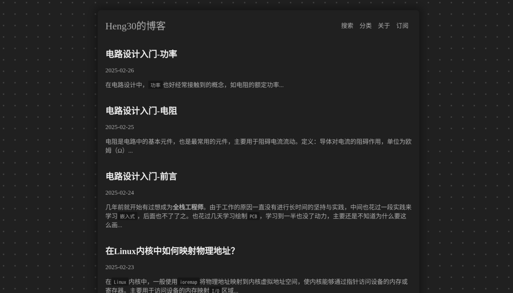

[English Document](./README.md)

#### 介绍
这是一个简洁的博客，使用`Rust Rocket`提供`web`服务并通过`html`模板生成网页。

#### 如何部署？
第一次启动后会生成默认`html`模板，模板在`~/.local/share/sblog/template`目录下。包含以下文件：
````
template
├── about-body.html
├── about-body.md
├── frame.html
├── header.html
├── home-body.html
└── post-body.html
````
- `about-bodd.md`文件空，需要根据自己的需要填写具体内容，内容格式为`Markdown`。
- 也可以根据自己需要，修改`html`文件。

第一次启动后会生成默认的配置文件，配置文件为`~/.config/sblog/sblog.conf`。
````
{
  "server": {
    "listen_address": "0.0.0.0",
    "listen_port": 8080
  },
  "rssinfo": {
    "author": "author",
    "email": "your-email",
    "uri": "https://example.com"
  },
  "webinfo": {
    "site_logo_tab": "/assest/logo.png",
    "site_logo": "/assest/logo.png",
    "site_name": "your-blog-name"
  }
}
````
`rssinfo`和`webinfo`是`html`模板的参数，**必须**填写。

#### 如何发布文章？
- 文章应该放在`~/.local/share/sblog/post/md`目录下。文章格式为`Markdown`, 文章名格式**必须**为：`title@@tag@@publish-date`。例子： `markdown@@tag1,tag2@@2023-12-01.md`。
- `homepage`和`rss`需要`summary`信息，`summary`信息保存在`~/.local/share/sblog/post/summary`目录下。文件名**必须**保持与文章的`title`一致。`summary`格式为：`title.summary`。例子：`markdown.summary`。
- 博客的资源文件可以保存在`~/.local/share/sblog/post/assest`目录下。文章中可以使用：`[example](/post/assest/a.txt)`来引用。

#### 如何构建？
- 安装`Rust`和`Cargo`
- 执行`make`
- [Makefile](./Makefile)了解更多

#### 如何测试？
- 启动`sblog`服务。
- 执行`make install-testdata`安装测试数据。
- 打开浏览器访问`localhost:8080`即可访问测试数据。
- 执行`make uninstall-testdata`删除测试数据。**注意**：会删除所有文章。

#### 参考
- [Rocket](https://rocket.rs/v0.5-rc/guide/introduction/)
